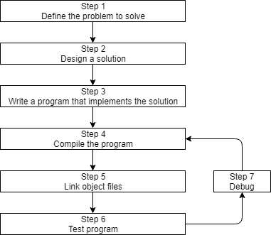
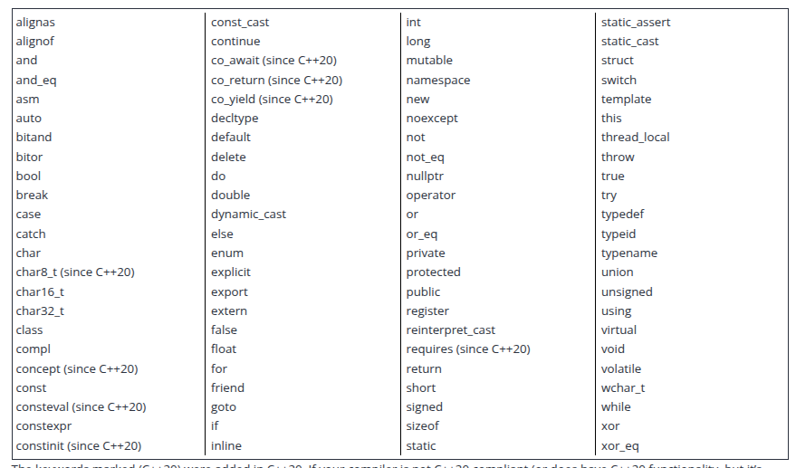

# Resumo C++

Resumo de módulos do C++, para utilizar no futuro. Usando como base o site: https://www.learncpp.com/



## Primeiros passos

Para iniciar o ambiente para realizar códigos utilizando c++, utilizando g++ como compiler:

1. Seguir step by step desse link: https://code.visualstudio.com/docs/cpp/config-linux. Vai do zero até conseguir compilar um hello world simples porém funcional
2. Importante: utilizar a versão v1.29.3 da extensão C/C++ do vscode
3. Exemplo de tasks.json do vscode:

```json
{
    "tasks": [
        {
            "type": "cppbuild",
            "label": "C/C++: gcc build active file",
            "command": "/usr/bin/g++",
            "args": [
                "-fdiagnostics-color=always",
                "-g",
                "${file}",
                "-o",
                "${fileDirname}/${fileBasenameNoExtension}.exe"
            ],
            "options": {
                "cwd": "${fileDirname}"
            },
            "problemMatcher": [
                "$gcc"
            ],
            "group": {
                "kind": "build",
                "isDefault": true
            },
            "detail": "Task generated by Debugger."
        }
    ],
    "version": "2.0.0"
}
```
4. [Guidelines C++](https://isocpp.github.io/CppCoreGuidelines/CppCoreGuidelines)

## Básicos

Exemplo de um código básico de C++, contendo:
- Condições
- loop com for e while
- operação binária
- input e output
- 


## Keywords

Todas as keywords:



## Main Status codes:

The C++ standard only defines the meaning of 3 status codes: 0, EXIT_SUCCESS, and EXIT_FAILURE. 0 and EXIT_SUCCESS both mean the program executed successfully. EXIT_FAILURE means the program did not execute successfully.

EXIT_SUCCESS and EXIT_FAILURE are preprocessor macros defined in the <cstdlib> header:

#include <cstdlib> // for EXIT_SUCCESS and EXIT_FAILURE

int main()
{
    return EXIT_SUCCESS;
}
If you want to maximize portability, you should only use 0 or EXIT_SUCCESS to indicate a successful termination, or EXIT_FAILURE to indicate an unsuccessful termination.


## Forward declaration

Declarar uma função no inicio do código, e depois em outra parte do código definir ela. Exemplo:

```cpp
#include <iostream>

int add(int x, int y); // forward declaration of add() (using a function declaration)

int main()
{
    std::cout << "The sum of 3 and 4 is: " << add(3, 4) << '\n'; // this works because we forward declared add() above
    return 0;
}

int add(int x, int y) // even though the body of add() isn't defined until here
{
    return x + y;
}
```